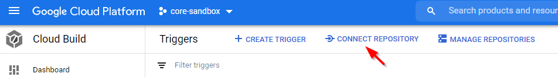

# Hackathon instructions

## Mirror this repo to your own private repo
1. Create a **private** repo in GitHub under your user name called terraform-google-cloud-build
2. Mirror  the supersmo/terraform-google-cloud-build repo to your new private repo by following these instructions:

Open Git Bash
Create a variable for your username:
```
github_user=<your-github_user>
```
Create a bare clone of the repository: 
```
git clone --bare https://github.com/supersmo/terraform-google-cloud-build.git
```
Mirror-push to the new repository: 
```
git push --bare https://github.com/${github_user}/terraform-google-cloud-build.git
```
Remove the temporary local repository you created earlier. 
```
cd ..
rm -rf terraform-google-cloud-build.git
```

Clone the repository: 
```
git clone https://github.com/${github_user}/terraform-google-cloud-build.git
```

Git will use the username and e-mail stored in the git global config which probably already is configured to be your work e-mail. If you wish to change the commit username and email only for this repo:
```
cd terraform-google-cloud-build
git config user.name <your name>
git config user.email <your e-mail>
```

## Make pushes to your repo trigger cloud build ##
### Setup Github to Cloud Build integration ###
1. Log in to gcp and go to your gcp project: https://console.google.com  
  

2. Go to Cloud Build –> Triggers and click Connect Repository  
  

3. Select source:  
  

4. Log in to your GitHub account (if you're not already logged in)    

5. Install the cloud build app on your **private** repo  
  

6. Select the google project to connect to  
  

7. Connect your repository  
  

8. Create a default push trigger  
  

### Modify default trigger ###
9. Edit the default push trigger to:
* support different triggers for main and feature branches
* add an environment variable  


### Create a trigger for the main branch ###
10. Create a trigger for the main branch:Duplicate the trigger to create a separate trigger and cloudbuild.yaml for the main branch


11. Edit the trigger to only trigger on the main branch


